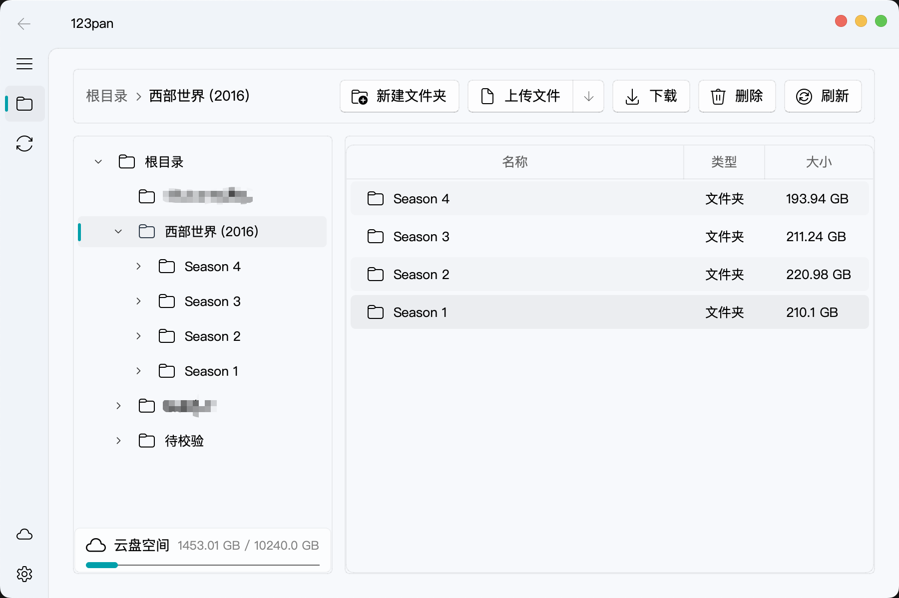
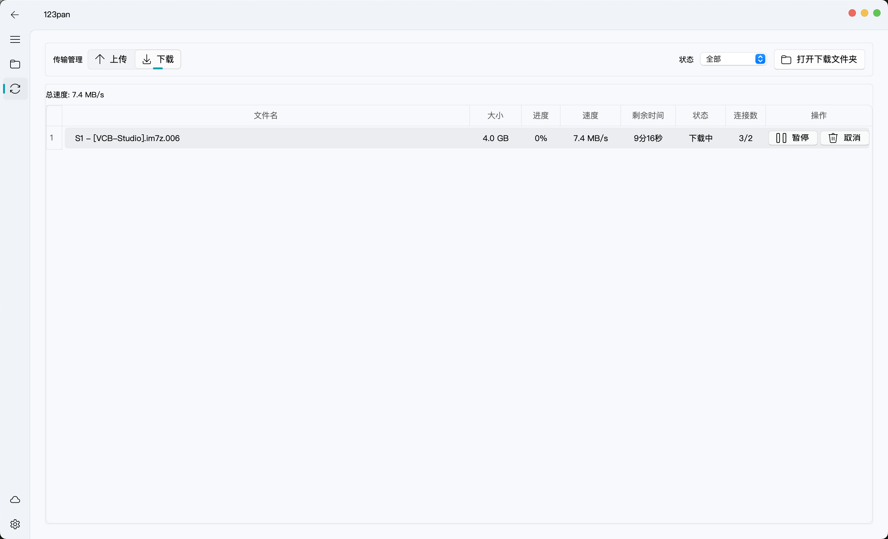
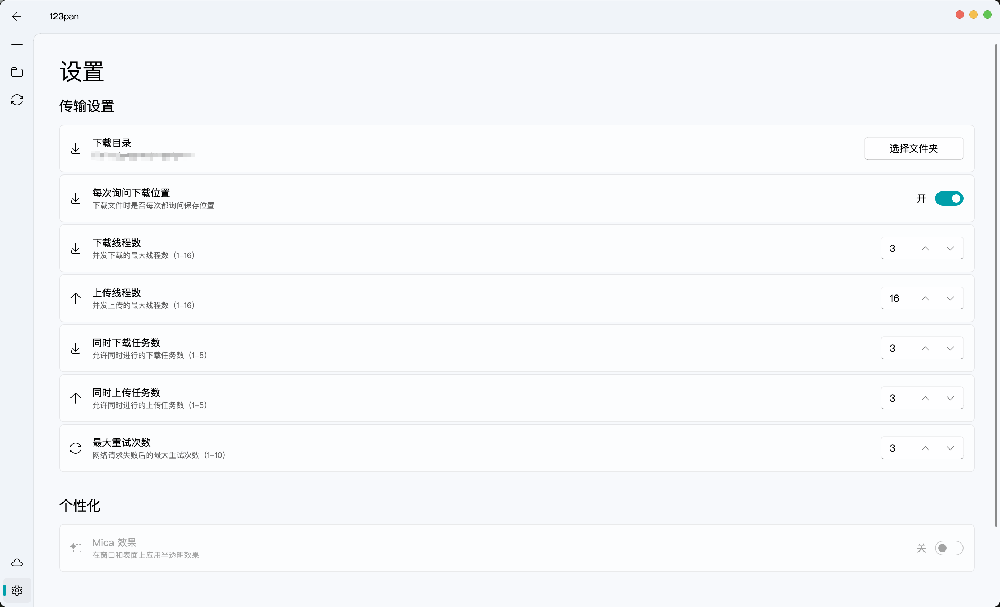
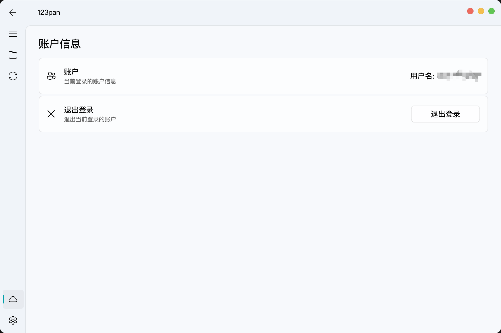

<div align="center">

# 123pan

**高性能 123 云盘第三方客户端 | 多线程传输 · 断点续传 · 全平台支持**

<div>
  <a href="https://github.com/crmmc/123pan/stargazers"></a>
  <a href="https://github.com/crmmc/123pan/blob/main/LICENSE"></a>
  <a href="https://github.com/crmmc/123pan/releases"></a>
  <a href="https://github.com/crmmc/123pan/releases"></a>
</div>
<div>
  
  
  
  <a href="https://github.com/crmmc/123pan/actions/workflows/build.yaml"></a>
  <a href="https://github.com/crmmc/123pan/actions/workflows/test.yaml"></a>
</div>

<br>



<sub>文件管理 · 双栏布局 · 面包屑导航 · 云盘空间卡片</sub>

</div>

---

> 基于 [123panNextGen/123pan](https://github.com/123panNextGen/123pan) 重构，采用 PySide6 + Fluent Design 全新界面，新增多线程传输、断点续传、完整文件管理等功能。采用安卓客户端的 api 端点，实现更稳定的多线程上传功能。解决官方 pc 客户端的上传功能不能跑满多宽带负载均衡的问题。

## 特性亮点

| 特性 | 说明 |
|:---|:---|
| 🚀 多线程传输 | 下载/上传支持 1–16 线程并发，充分利用带宽 |
| 🔁 断点续传 | 下载和上传均支持断点续传，大文件传输不怕中断 |
| 🎨 Fluent Design | 基于 PySide6-Fluent-Widgets，现代化流畅设计风格 |
| 📁 完整文件管理 | 文件夹树 + 面包屑导航 + 拖拽上传 + 右键菜单 + 批量操作 |
| 📋 任务管理 | 暂停/继续/取消/重试，实时速度与进度，状态筛选 |
| 💾 持久化存储 | SQLite 替代 JSON，任务状态跨会话保留 |
| 🌍 全平台 | Windows / Linux / macOS（x64 + ARM64），CI 自动构建 |
| 🔧 工程化 | mypy 类型检查 + pylint + pytest 单元测试 |

## 界面展示

### 传输管理



> 实时显示速度 · 进度 · 剩余时间 · 连接数，支持暂停/继续/重试

### 设置



> 下载/上传线程数 · 并发任务数 · 重试次数，完整传输参数可配

### 账户与登录

<table>
  <tr>
    <td width="62%">
      
      <p align="center"><sub>账户信息 · 一键退出登录</sub></p>
    </td>
    <td width="38%">
      
      <p align="center"><sub>登录 · 自动登录选项</sub></p>
    </td>
  </tr>
</table>

## 安装

### 下载预构建版本

前往 [Releases](https://github.com/crmmc/123pan/releases) 下载对应平台的可执行文件，下载后直接运行即可：

| 平台 | 架构 | 文件名 |
|:---|:---|:---|
| Windows | x64 | `123pan-windows-x64.exe` |
| Windows | ARM64 | `123pan-windows-arm64.exe` |
| Linux | x64 | `123pan-linux-x64` |
| Linux | ARM64 | `123pan-linux-arm64` |
| macOS | Intel | `123pan-macos-x64` |
| macOS | Apple Silicon | `123pan-macos-arm64` |

### 从源码运行

需要 [Python 3.12+](https://www.python.org/downloads/) 和 [uv](https://github.com/astral-sh/uv)。

```bash
git clone https://github.com/crmmc/123pan.git
cd 123pan
uv sync
uv run src/123pan.py
```

## 构建

```bash
uv sync --extra build
bash script/build.sh
```

生成的可执行文件位于项目根目录。支持 Windows、Linux、macOS 三平台。

## 技术栈

| 组件 | 技术 |
|:---|:---|
| GUI 框架 | PySide6 + PySide6-Fluent-Widgets |
| 数据存储 | SQLite（配置 + 任务持久化） |
| 打包工具 | Nuitka（编译为单文件可执行） |
| 包管理 | uv |
| CI/CD | GitHub Actions（6 平台自动构建 + Release） |
| 质量保证 | mypy + pylint + pytest |

## 许可证

[Apache 2.0](./LICENSE)

**本工具仅用于学习研究，请勿用于商业用途。使用者需遵守 123 云盘用户协议，滥用可能导致账号限制。**

## 致谢

本项目 fork 自 [123panNextGen/123pan](https://github.com/123panNextGen/123pan)，感谢原作者的基础工作。

---

<div align="center">
由 <a href="https://github.com/crmmc">crmmc</a> 维护
</div>
