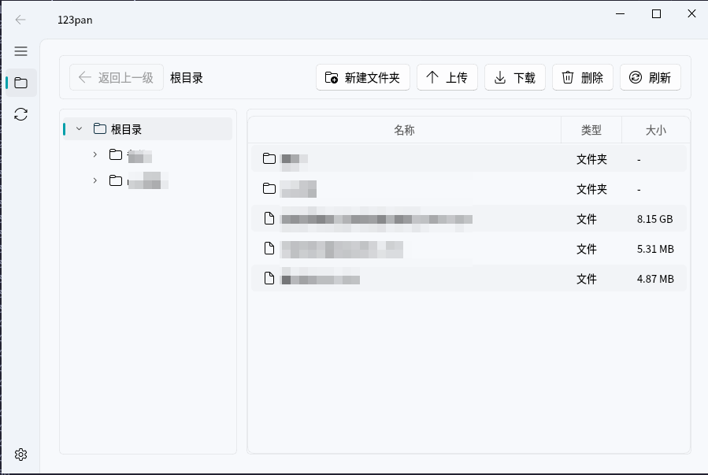

<div align="center">  

  # 🚀 [123pan](https://www.123panng.top)
  
  <p>突破限制 · 高效下载 · 简单易用</p>
  
  <div>
    <a href="https://github.com/Qxyz17/123pan/stargazers"></a>
    <a href="https://github.com/Qxyz17/123pan/blob/main/LICENSE"></a>
    <a href="https://www.python.org/"></a>
    <a href="https://github.com/Qxyz17/123pan/releases"></a>
  </div>
  <br>
  

</div>

## 介绍
123pan是一款基于Python开发的高效下载辅助工具，通过模拟安卓客户端协议，帮助用户绕过123云盘的自用下载流量限制，实现无阻碍下载体验。

## 项目源码结构
```
.
├── 123pan.pro
├── 123pan.py
├── app
│   ├── common
│   │   ├── api.py
│   │   ├── config.py
│   │   ├── log.py
│   │   ├── resource.py
│   │   └── style_sheet.py
│   ├── resource
│   │   ├── qss
│   │   │   ├── dark
│   │   │   │   ├── gallery_interface.qss
│   │   │   │   ├── home_interface.qss
│   │   │   │   ├── icon_interface.qss
│   │   │   │   ├── link_card.qss
│   │   │   │   ├── navigation_view_interface.qss
│   │   │   │   ├── sample_card.qss
│   │   │   │   ├── setting_interface.qss
│   │   │   │   └── view_interface.qss
│   │   │   └── light
│   │   │       ├── gallery_interface.qss
│   │   │       ├── home_interface.qss
│   │   │       ├── icon_interface.qss
│   │   │       ├── link_card.qss
│   │   │       ├── navigation_view_interface.qss
│   │   │       ├── sample_card.qss
│   │   │       ├── setting_interface.qss
│   │   │       └── view_interface.qss
│   │   └── resource.qrc
│   └── view
│       ├── file_interface.py
│       ├── login_window.py
│       ├── main_window.py
│       ├── setting_interface.py
│       └── transfer_interface.py
├── build.sh
├── requirements.txt
├── resource_build.bat
└── resource_build.sh

8 directories, 33 files
```

## 使用
### 使用打包后的文件运行
如果你的电脑是windows系统或者linux发行版，可以直接下载打包后的文件并运行。  
下载地址：
- Github: https://github.com/123panNextGen/123pan/releases/
- Website(CloudFlare CDN, 更新可能不及时): https://download.123panng.top/

其他系统以及开发请参考下方的源码运行。

### 使用源码运行
首先准备好[Python3](https://www.python.org/downloads/)环境，并克隆存储库。
```shell
git clone https://github.com/123panNextGen/123pan.git
cd 123pan/
```
准备Python虚拟环境。
```shell
#若网络情况较差 可以提前配置好pip镜像站
#pip config set global.index-url https://mirrors.tuna.tsinghua.edu.cn/pypi/web/simple
python -m venv .venv
.venv/bin/pip install -r src/requirements.txt
```
然后运行`src`下的`123pan.py`即可。
```shell
.venv/bin/python src/123pan.py
```

## 技术说明
默认会在系统`C:\Users%USERNAME%\AppData\Roaming\Qxyz17\123pan`或`~/.config/Qxyz17/123pan`创建配置文件和日志。
```json
{
  "userName": "账号",
  "passWord": "密码",
  "authorization": "令牌",
  "deviceType": "驱动类型",
  "osVersion": "安卓版本",
  "settings": {
    "defaultDownloadPath": "默认下载路径",
    "askDownloadLocation": 开关
}
```

## 问题反馈
你可以通过多种途径反馈问题。
- Github: https://github.com/123panNextGen/123pan/issues
- QQ群: 996241397

我们将在第一时间解决。

## 代码贡献
我们很欢迎您来为项目添砖加瓦，但是请遵守以下几点：
- 不要提交未测试的代码
- 不要提交无意义的内容
- 不要提交涉及隐私的内容
- 请向dev分支提交pr

我们还提供了开发交流群，可以在用户交流群中联系管理员获得。

## 使用协议
本程序使用[Apache 2.0](./LICENSE)协议。  
本工具仅用于学习研究，请勿用于商业用途，使用者需遵守123云盘用户协议，滥用可能导致账号限制。

---
[](https://www.star-history.com/#123panNextGen/123pan&type=date&legend=top-left)

本程序由[123panNextGen](https://github.com/123panNextGen)开发团队用♥️制作～  
我们由衷感谢为本程序贡献代码的人们。 [贡献人员名单](https://github.com/123panNextGen/123pan/graphs/contributors)

<!--
 ⠀⠀⠀⠀⠀⠀⠀⠀⠀⠀⠀⠀⠀⠀⠀⠀⣀⣀⡀⠀⠀⣀⡀⠀⠀⠀⠀⠀⠀⠀
⠀⠀⠀⠀⠀⠀⠀⠀⠀⠀⠀⠀⠀⠀⠀⢸⣿⣿⣿⠀⣼⣿⣿⣦⡀⠀⠀⠀⠀⠀
⠀⠀⠀⠀⠀⠀⠀⠀⠀⠀⣀⠀⠀⠀⠀⢸⣿⣿⡟⢰⣿⣿⣿⠟⠁⠀⠀⠀⠀⠀
⠀⠀⠀⠀⠀⠀⠀⠀⢰⣿⠿⢿⣦⣀⠀⠘⠛⠛⠃⠸⠿⠟⣫⣴⣶⣾⡆⠀⠀⠀
⠀⠀⠀⠀⠀⠀⠀⠀⠸⣿⡀⠀⠉⢿⣦⡀⠀⠀⠀⠀⠀⠀⠛⠿⠿⣿⠃⠀⠀⠀
⠀⠀⠀⠀⠀⠀⠀⠀⠀⠙⢿⣦⠀⠀⠹⣿⣶⡾⠛⠛⢷⣦⣄⠀⠀⠀⠀⠀⠀⠀
⠀⠀⠀⠀⠀⠀⠀⠀⠀⠀⠀⣿⣧⠀⠀⠈⠉⣀⡀⠀⠀⠙⢿⡇⠀⠀⠀⠀⠀⠀
⠀⠀⠀⠀⠀⠀⠀⢀⣠⣴⡿⠟⠋⠀⠀⢠⣾⠟⠃⠀⠀⠀⢸⣿⡆⠀⠀⠀⠀⠀
⠀⠀⠀⠀⢀⣠⣶⡿⠛⠉⠀⠀⠀⠀⠀⣾⡇⠀⠀⠀⠀⠀⢸⣿⠇⠀⠀⠀⠀⠀
⠀⢀⣠⣾⠿⠛⠁⠀⠀⠀⠀⠀⠀⠀⢀⣼⣧⣀⠀⠀⠀⢀⣼⠇⠀⠀⠀⠀⠀⠀
⠀⠈⠋⠁⠀⠀⠀⠀⠀⠀⠀⠀⢀⣴⡿⠋⠙⠛⠛⠛⠛⠛⠁⠀⠀⠀⠀⠀⠀⠀
⠀⠀⠀⠀⠀⠀⠀⠀⠀⠀⣀⣾⡿⠋⠀⠀⠀⠀⠀⠀⠀⠀⠀⠀⠀⠀⠀⠀⠀⠀
⠀⠀⠀⠀⠀⠀⠀⠀⠀⢾⠿⠋⠀⠀⠀⠀⠀⠀⠀⠀⠀⠀⠀⠀⠀⠀⠀⠀⠀⠀ 
-->